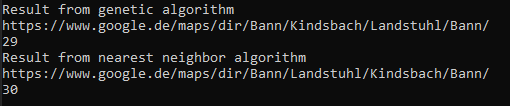
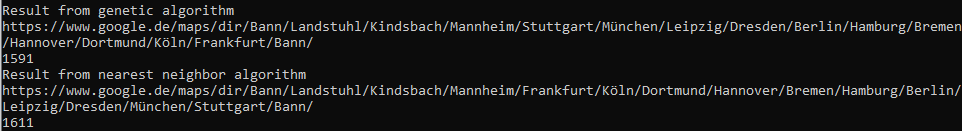
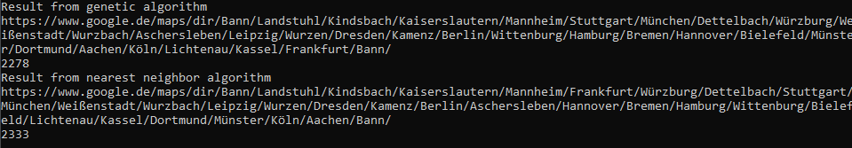

# best_route
Attempts to find the best route for the traveling salesman problem with the use of genetic algorithms.
As a baseline the nearest neighbor approach is used.
The script outputs the best route as a google maps link.

Use the script from the command line as follows:
python3 main.py City1 City2 City3 etc...
e.g.: python3 main.py Berlin Hamburg Mainz -> this will calculate the best route from Berlin to Berlin while visiting Hamburg and Mainz exactly once.

Here are some examples:

The genetic algorithm will find a better solution than the nearest neighbor approach.
With increasing city count the genetic algorithm will get worse.
In my experiments the genetic algorithm started to get way worse at about 30 cities.
For the everyday use or to plan your next round trip this script should suffice.
